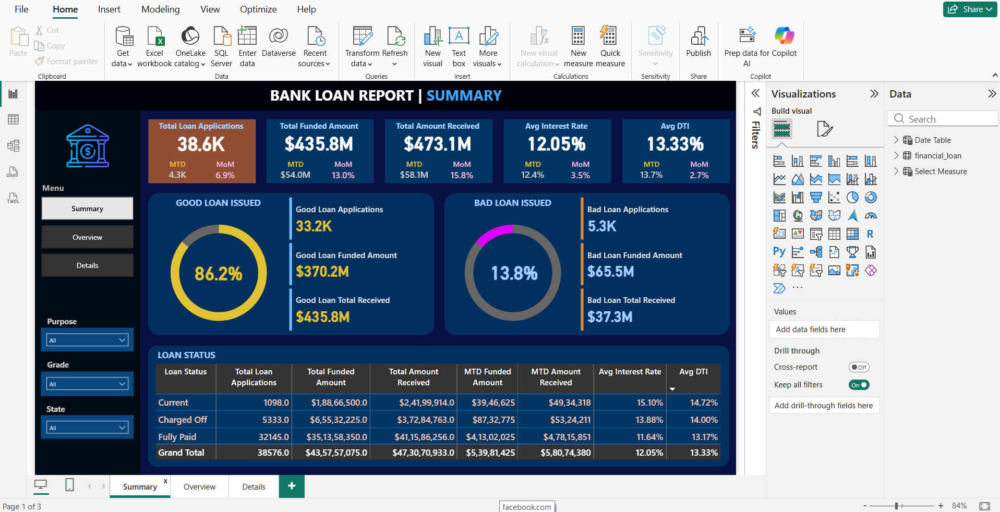
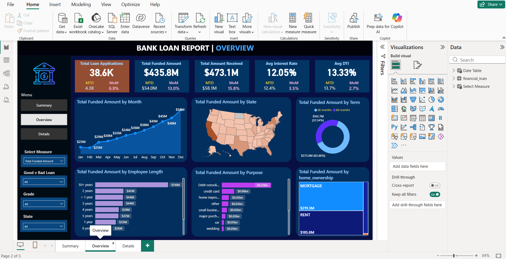
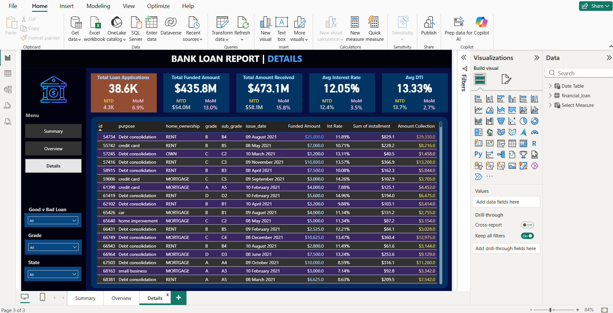

# Bank Loan Analytics Dashboard

## Project Overview

Developed an end-to-end Bank Loan Analytics Dashboard using Power BI to analyze loan applications, borrower profiles, lending performance, repayment trends, and portfolio health. The dashboard enables financial institutions to monitor loan performance and support data-driven decision-making.

## Tools Used

- Power BI
- SQL
- DAX
- Power Query
- Excel

## Key KPIs

- Total Loan Applications
- Total Funded Amount
- Total Amount Received
- Average Interest Rate
- Average Debt-to-Income Ratio (DTI)
- Good Loan Percentage
- Bad Loan Percentage

## Dashboard Pages

### Summary Dashboard

Provides a high-level overview of loan portfolio performance and loan quality.

Key Analysis:
- Good Loan vs Bad Loan Analysis
- Loan Status Analysis
- Funded Amount Analysis
- Amount Received Analysis
- Interest Rate Analysis
- DTI Analysis

### Overview Dashboard

Provides detailed insights into lending trends and borrower characteristics.

Key Analysis:
- Monthly Loan Funding Trends
- State-wise Loan Distribution
- Loan Term Analysis
- Employee Length Analysis
- Loan Purpose Analysis
- Home Ownership Analysis

### Details Dashboard

Provides transaction-level loan information for detailed exploration and reporting.

Includes:
- Loan ID
- Loan Purpose
- Home Ownership
- Loan Grade & Sub Grade
- Issue Date
- Funded Amount
- Interest Rate
- Installment Amount
- Amount Collected

## Business Objectives

- Monitor loan portfolio performance.
- Analyze lending trends and borrower behavior.
- Evaluate loan quality and repayment performance.
- Identify risk patterns across customer segments.
- Support lending and portfolio management decisions.

## Key Insights

- Analyzed loan applications across different borrower profiles and loan categories.
- Evaluated loan performance based on funding, repayments, and loan status.
- Identified trends across loan purposes, states, employment history, and home ownership categories.
- Assessed portfolio quality using loan performance indicators and risk-related metrics.
- Generated actionable insights to support business and lending decisions.

## Business Impact

- Improved visibility into loan portfolio performance.
- Supported loan quality monitoring and risk assessment.
- Enabled data-driven decision-making through interactive dashboards.
- Enhanced understanding of borrower demographics and lending trends.

## Dashboard Screenshots

### Summary Dashboard

### Overview Dashboard

### Details Dashboard

